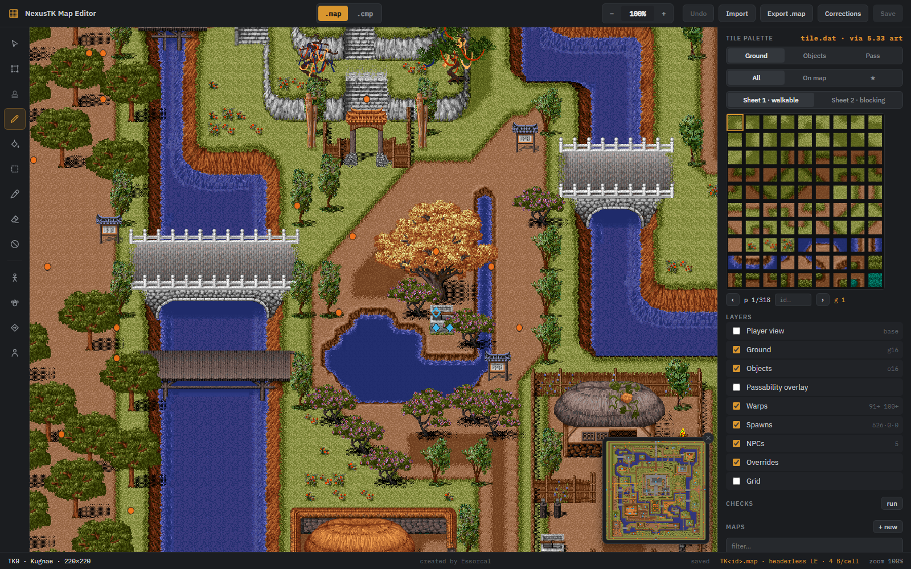
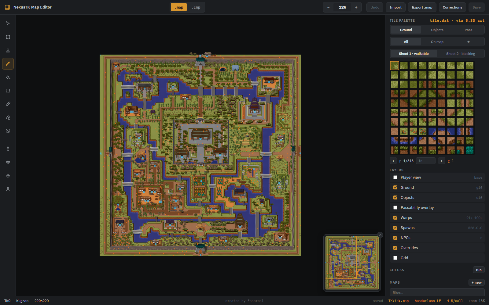
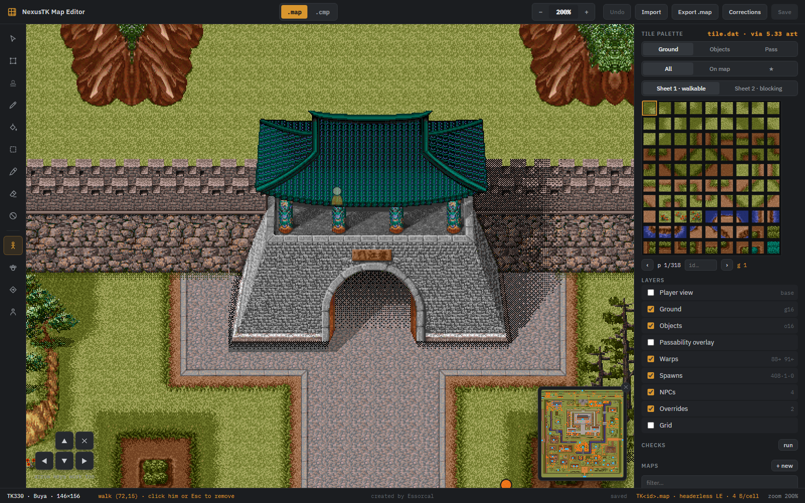
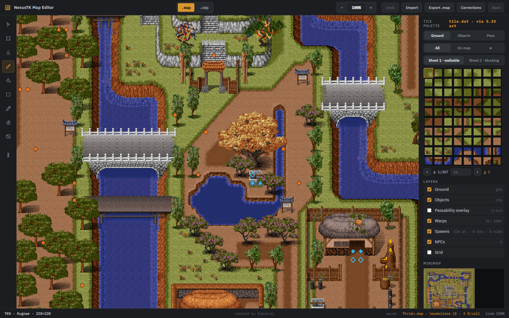

# NexusTK Map Editor

A visual editor for Project1998's world maps. It renders the game's maps with the real
5.33 client tile art — verified pixel-identical to the running game — and edits the 4.x
`.map` files the server actually serves, with import/export for both client formats.



## Installation

### The easy way (no tools required)

1. Grab the **NexusTK-Map-Editor** folder (contains `NexusTK-Map-Editor.exe` and a
   `wwwroot` folder — keep them together).
2. Put that folder anywhere **inside your Project1998 checkout** (for example
   `Project1998\dist\NexusTK-Map-Editor\`). The editor finds the maps by looking for a
   `game-data\maps` folder in the directories above it.
3. Double-click `NexusTK-Map-Editor.exe`.

A console window opens, decodes the tileset (about a second), and your browser opens the
editor automatically. **Keep the console window open** — closing it stops the editor.

The editor also needs the 5.33 client's `Tile.dat` for the artwork. It looks, in order:

| Where | Notes |
|---|---|
| `P1998_CLIENT5` environment variable | points at the 5.33 client folder |
| next to the `.exe` | drop a copy of `Tile.dat` beside the program |
| `%LOCALAPPDATA%\Project1998\game\533\` | the standard Project1998 client install |

If either the maps or `Tile.dat` can't be found, the console says exactly what's missing
and where it looked.

### From source

```
dotnet run --project MapEditor
```

To build the standalone exe yourself:

```
dotnet publish MapEditor/MapEditor.csproj -c Release -r win-x64 --self-contained -p:PublishSingleFile=true -p:AssemblyName=NexusTK-Map-Editor -o dist/NexusTK-Map-Editor
```

## A quick tour

- **Top bar** — the `.map` / `.cmp` format switch (hover for which client each belongs
  to), zoom controls, Undo, Import, Export, and Save.
- **Left rail** — the tools (hover any icon for what it does): select, marquee, stamp,
  brush, flood fill, rectangle, eyedropper, eraser, passability toggle, and the test
  character.
- **Right panel** — the tile palette, layer toggles, and the map list. **Drag the
  panel's left edge** to make it wider; the palette grows more columns.
- **Bottom bar** — current map, the cell under your cursor (its ground word, pass flag
  and object id), tool hints, unsaved-change count, and zoom.

## Finding tiles

The palette has three modes:

- **All** — the entire tileset, with a page browser and an `id…` box that jumps straight
  to a tile number (decimal, or `0xC0CC`-style hex for sheet-2 words).
- **On map** — only the tiles and objects actually placed on the current map. For most
  editing this is the mode you want: a big city uses a few hundred tiles, not 28,000.
- **★ (favorites)** — your personal palette. **Right-click any swatch** to star or
  unstar it; favorites persist between sessions.

**Shift+click** a second swatch to select a rectangular block of tiles — the brush then
stamps the whole block at once, and the rectangle tool tiles it as a repeating pattern
(a plain click returns to single-tile painting). **Hover a swatch** to see it magnified — objects preview as their full sprite (a tree
shows the whole tree, not one 24px slice). The **eyedropper** works the other way: click
any cell in the map and the palette jumps to that tile, brush ready.

On the Ground tab, **Sheet 1 · walkable** and **Sheet 2 · blocking** are the game's two
ground-tile sheets. This is a real 4.x format rule, not an editor invention: a cell's
sheet choice *is* its collision. Sheet-2 tiles (walls, cliffs, water) always block;
sheet-1 tiles never do. Paint a wall tile and you've painted its collision too.

## Navigating

Zoom from **10% to 500%**: the top-bar − / + buttons, typing a percentage into the box,
`Ctrl` + mouse wheel, or the `+` / `-` keys. Zoomed out you can see a whole city at once;
at 100% and above every step is pixel-crisp.



Pan with **space + drag**, middle-mouse drag, the mouse wheel (`Shift` for horizontal),
or the arrow keys.

The **minimap** floats in the bottom-right corner of the canvas: the whole map with the
current view marked — click or drag on it to jump. It carries the marker layers' dots,
so a city's warps and spawns are visible at a glance. The ✕ on its corner hides it (a
small map button in the same spot brings it back), and the choice persists.

## Editing

| Tool | What it does |
|---|---|
| Select | inspect a cell — the bottom bar shows its ground word, pass flag, object |
| Marquee | drag a box; the region is **copied on release** |
| Stamp | click to paste the copied region, as many times as you like — all layers |
| Brush | paint the selected tile (click or drag); Ground/Objects/Pass tabs pick the layer |
| Fill | flood-fill the contiguous region under the cursor on the active layer |
| Rectangle | drag a box, fills it with the selected tile |
| Eyedropper | pick the tile under the cursor into the palette |
| Eraser | ground → void, object → none, pass → walkable |
| No-entry | toggle a cell's passability (this flips its ground sheet — see above) |

**Ctrl+Z** undoes stroke by stroke. The **Passability overlay** (Layers panel) tints
every blocking cell red.

## Saving — drafts, never the live maps

This is a development tool, so **nothing the editor generates goes into `game-data`**.
Everything it produces lives with the tool under `dist\NexusTK-Map-Editor\saved\`:

- `saved\maps\TK<id>.map` — draft saves (**Save / Ctrl+S**)
- `saved\csvs\` — exported Corrections and Spawns rows

Save **never overwrites the shipped map** in `game-data\maps`. Loading a map prefers its
draft, so your work is there next session; the status bar shows `· draft`, and the map
list marks drafted maps with a dot. The **Discard draft** button deletes the draft and
reloads the shipped map.

Getting an edit into the actual game is deliberate and manual — either:

- copy `saved\maps\TK<id>.map` over `game-data\maps\TK<id>.map` yourself
  (then `@reload` on the server), or
- for small fixes, use **Corrections** (below) and append the rows to
  `game-data\MapCells.csv` — the server applies those as overrides and streams them to
  clients, no map file replacement needed.

## The test character

The last tool in the rail drops a walkable test character. Move with the **arrow keys**
or the on-screen pad; blocked cells refuse the step, and walking behind trees, roofs and
walls shows the same translucent ghost the real client draws. Remove the character by
clicking it, pressing `Esc`, or the ✕ on the pad.



## World markers

Three read-only overlay layers (Layers panel) show the cells that server content points
at, so you don't paint over them blind. They read the live `game-data` CSVs on every map
load — edit a CSV and reload to see the change.

- **Warps** — cyan diamonds from `Warps.csv`: **filled** = a warp *out* lives on this
  cell, **hollow** = some other map's warp *lands* here. Violet diamonds are the
  world-map screen's cells (`WorldMapTriggers.csv` trigger bands and
  `WorldMapDests.csv` arrival points).
- **Spawns** — orange dots for fixed spawn points (`Spawns.csv`), dashed orange boxes
  for area-spawn regions (`AreaSpawns.csv`), labeled with the mob and count. Rows that
  spawn "anywhere walkable" have no box; hover the layer row for the list.
- **NPCs** — green squares (`NPCs.csv`).
- **Overrides** — hollow pink squares for `MapCells.csv` authored overrides. The editor
  draws the shipped file, but the server rewrites these cells on load — so players see
  something different there. Hover for the row's values ("override → tile 859, pass 0"),
  and check here before "fixing" a cell that may already be fixed: a new Corrections row
  for the same cell would shadow the existing hand-authored one.



Hovering any marked cell names it in the bottom bar — the warp's destination, the mob,
the NPC. Below 100% zoom the glyphs become solid cell tints so they stay visible in a
whole-map overview.

## Checks

The **run** button in the Checks section scans the loaded map for suspicious cells:
warp **arrivals** and **spawn points** sitting on blocked ground, and walkable edges
into void. Click a finding to jump to the cell. Blocked warp *sources* are deliberately
not flagged — a doorway warp on a blocked cell is the game's normal idiom (the warp
fires before collision is checked).

## Exporting corrections

The server applies `game-data/MapCells.csv` rows as authored overrides on top of the
shipped `.map` files — "the shipped map is wrong here". The **Corrections** button turns
your edits into exactly those rows: it diffs the editor's buffer against the shipped map
in `game-data\maps` (saves are drafts, so the shipped file is always the baseline) and
writes one CSV row per changed cell to `saved\csvs\mapcells-TK<id>.csv`, with unchanged
columns left blank so they inherit from the `.map`. A three-cell fix becomes three
reviewable lines in git instead of a rewritten binary map. Works with unsaved changes
too.

## Placing spawns

The paw tool in the rail places monster spawn points. Pick a mob in the **spawn box**
(bottom-left; search by name or id), then click cells — yellow dots mark pending points
(click one to remove it; blocked cells are refused). Placements are per-map, live only
in your browser, and survive reloads.

**Export rows** writes `Spawns.csv` rows for the pending points to
`saved\csvs\spawns-TK<id>.csv`, `SpnId` numbered after the file's current maximum. Same
rule as everything else here: the editor never writes the game files — append the rows
to `game-data\Spawns.csv` yourself, `@reload` on the server, and reload the map in the
editor (the points then show as regular orange spawn markers; clear the yellow pending
ones with **Clear all**).

## Placing NPCs

The person tool places NPCs as **copies of an existing NPC** — pick a template in the
box (search the ~370 NPCs by name or identifier), then click cells. The template
supplies the look, type, and behavior flags — the parts the editor can't author — while
the two text fields override the identifier and display name: **keep the template's
identifier to reuse its dialog/shop scripts** (a second Bank clerk works out of the
box), or type a new one for an NPC you'll script later. Yellow squares mark pending
placements; blocked cells are allowed on purpose (the server stands NPCs where the CSV
says, wall or not).

**Export rows** writes full `NPCs.csv` rows (the file's own column order, `NpcId`
numbered past the current max, `Enabled` set) to `saved\csvs\npcs-pending.csv` — append
to `game-data\NPCs.csv` by hand, then `@reload`.

## Placing warps

The diamond-arrow tool places warp pairs in two clicks: click the **source** cell, then
the **destination** cell — you can switch maps between the two clicks, and `Esc` cancels
an armed source. Pending legs show as yellow diamonds (filled = source, hollow =
arrival); click one to remove its pair. The warp box lists every pending pair — clicking
a row jumps to its landing cell, the natural spot to start the **return leg**. Place the
return yourself: it is a separate doorway (in the real `Warps.csv` almost no pair is an
exact mirror), and the box marks pairs with no pending return with ⚠ — a one-way door
strands players unless `Warps.csv` already covers the way back.

**Export rows** writes `Warps.csv` rows to `saved\csvs\warps-pending.csv`, `WarpId`
numbered after the file's current maximum — append to `game-data\Warps.csv` by hand,
then `@reload`.

## Import & export

The `.map` / `.cmp` toggle selects the file format the Export button produces:

- **`.map`** — the 4.x client format: headerless, 4 bytes per cell. This is the format
  the server serves and the editor edits natively.
- **`.cmp`** — the 5.33 client format: `CMAP` header + zlib, 6 bytes per cell.

**Import** accepts either. A `.cmp` carries its own dimensions; a headerless `.map` will
ask for them (the editor suggests the likely factor pair from the file size). Both modes
render with the 5.33 tile art — that's the correct look for both eras, since the 5.33
tileset is the 4.x art plus additions.

## Sharing a spot

The address bar carries state you can link to:

```
http://127.0.0.1:5959/?map=330&at=72,15&zoom=200
```

`map` (id), `at` (x,y to center on), `zoom` (percent), and `walk` (x,y to drop the test
character) all work.

## Troubleshooting

- **The browser didn't open** — the console prints the address (usually
  `http://127.0.0.1:5959`); open it by hand.
- **A different port** — if 5959 is taken the editor picks the next free port and says
  so in the console; the auto-opened browser tab always goes to the right one. To pin a
  port (e.g. running one editor per checkout), pass `--port 5970`; `--no-browser` skips
  the auto-opened tab.
- **"Could not find the game data"** — the exe isn't inside a Project1998 checkout; move
  it there or set `P1998_REPO`.
- **"Tile.dat … not found"** — install the 5.33 client, or copy its `Tile.dat` next to
  the exe, or set `P1998_CLIENT5`.

---

*created by Essorcal*
